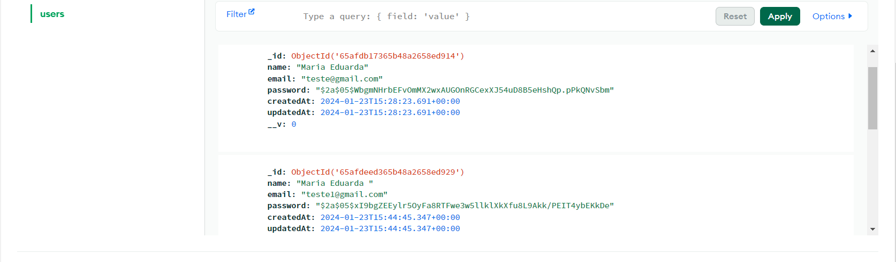
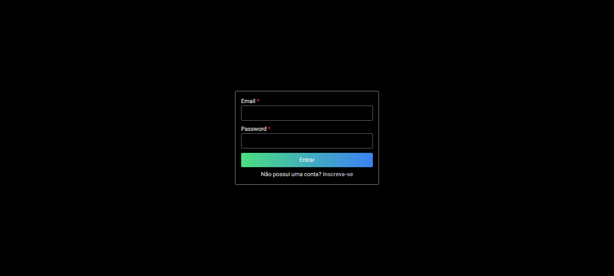

## Como rodar o projeto

Primeiro, rode em modo de desenvolvimento:

```bash
npm run dev
# or
yarn dev
# or
pnpm dev
# or
bun dev
```

</br>

### Ferramentas

- ReactJS
- Next
- Next-auth
- Typescript
- tailwindcss
- MongoDB
- Yup + formik
- bcryptjs

</br>

### projeto

mongoDB

<h1 align="center">
  
</h1>

<h1 align="center">
  
</h1>

link -> https://github.com/Maria-Eduarda90/next-auth-mongodb/blob/main/img/05.02.2024_12.45.23_REC.gif
